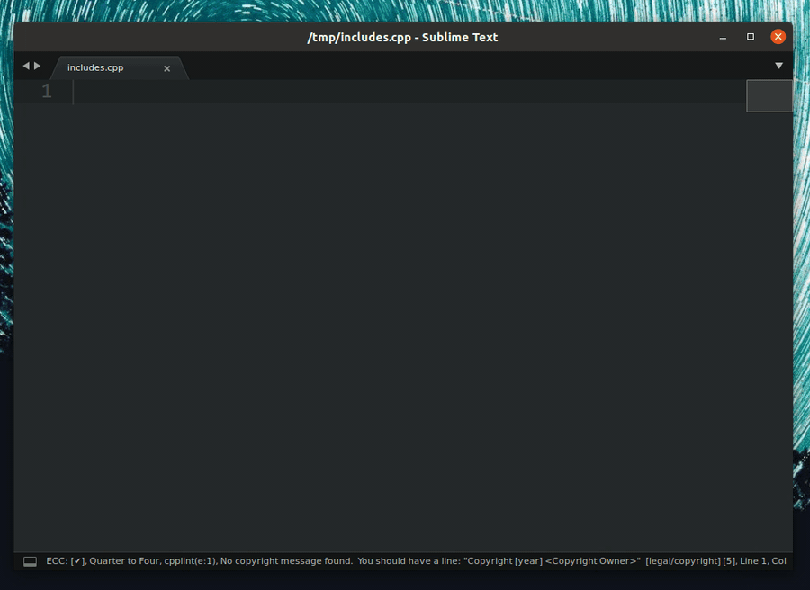

# Three levels of settings for EasyClangComplete
1. Project settings <small> (defined in a [`.sublime-project`][subl-proj] file for a specific project) </small>
2. Global user settings <small>(defined globally for the whole plugin)</small>
3. Default settings <small>(shipped with the plugin)</small>

!!! warning
    Project-related settings will only work when your code has a
    `.sublime-project` file related to it. For documentation on using the
    Sublime Text projects please refer [here][subl-proj].

## Settings hierarchy
1. If no settings are defined the **Default** ones are used
2. **User** settings have precedence over the **Default** ones
3. **Project** settings have precedence over the **User** and **Default** ones

## Common path wildcards
Every path variable in settings can contain wildcards:

- Any of [Sublime Text variables](https://www.sublimetext.com/docs/3/build_systems.html#variables). Most common ones:
    + `$project_base_path` is replaced by the full path to the root folder of
      the project to which the currently opened view belongs. This path is
      stored as "folder" variable within the `.sublime-project` file.
    + `$project_name` is replaced by the name of the current project.
- `$clang_version` is replaced by the numeric version of used clang.
- `~` is replaced by the path to user home directory.
- `*` and other glob wildcards can be used everywhere.

## Using environmental variables
In addition to the variables described above, you can use your environment
variables:

- OSX and Linux: `$variable_name` or `${variable_name}`
- Windows: `$variable_name`, `${variable_name}` or `%variable_name%`

## How to define project settings
The project-specific settings are only available when the code is within a Sublime Text project defined by a `*.sublime-project` file. They must be stored under the `"settings"` tab in the project file with either of the two prefixes: `ecc_` or `easy_clang_complete_`. See example below for more clarifications.

!!! example "Example of setting `verbose` and `use_libclang` project-specific settings"
    ```json tab="my_project.sublime-project"
    {
        "settings": {
            "easy_clang_complete_verbose": true,
            "ecc_use_libclang": true,
        }
    }
    ```

    Note that for `verbose` setting a prefix `easy_clang_complete_` is used,
    while for `use_libclang` we use `ecc_` prefix.

!!! note "Project settings override User and Default settings"
    The settings defined in the `*.sublime-project` file override User and Default settings. Keep that in mind when specifying them! They are **not appended**, they **override** these settings.

## Complete settings list
This is a complete guide over all settings. Here we look at every setting in
detail, explain where they are used and what are their default values.

### **`common_flags`**
Specify common flags that are passed to clang for **every** compilation. These
usually include common include paths that are needed for finding STL etc. Below
are typical defaults for Linux.

??? example "Good defaults for Linux <small>(click to expand)</small>"
    ```json
    "common_flags" : [
        "-I/usr/include",
        "-I$project_base_path/src",
        // this is needed to include the correct headers for clang
        "-I/usr/lib/clang/$clang_version/include",
    ],
    ```

??? example "Good defaults MacOS <small>(click to expand)</small>"
    ```json
    "common_flags" : [
        // some example includes
        "-I/usr/include/",
        "-I/usr/local/include",
        "-I/Library/Developer/CommandLineTools/usr/lib/clang/$clang_version",
        "-I/Library/Developer/CommandLineTools/usr/include/c++/v1",
    ],
    ```

??? example "Good defaults for Windows with MinGW <small>(click to expand)</small>"
    ```json
    "common_flags" : [
        "-IC:\\MinGW\\lib\\gcc\\mingw32\\6.3.0\\include\\c++",
        "-IC:\\MinGW\\lib\\gcc\\mingw32\\6.3.0\\include\\c++\\mingw32"
    ],
    ```

    Here I have installed MinGW from [MinGW downloads page](https://osdn.net/projects/mingw/releases/). Everything seems to work including the STL support.

### **`lang_flags`**
These flags are language-specific. They prepend `common_flags` when compiling files of a particular language. This is a good place to define flags for a standard library etc.

!!! example "Default value"
    ```json
    "lang_flags": {
      "C": ["-std=c11"],
      "CPP": ["-std=c++11"],
      "OBJECTIVE_C": ["-std=c11"],
      "OBJECTIVE_CPP": ["-std=c++11"],
    },
    ```

!!! warning
    When specifying this setting in your user or project settings make sure to
    keep ALL language keys.

### **`flags_sources`**
This setting defines external sources for the compilation flags. If you have a
build system <small>(e.g. CMake)</small> in place or have an external file that
defines all the compilation flags for your project <small>(e.g. a compilation
database `compile_commands.json`)</small>, you can load the flags directly from
there. For more details on differences between the flag sources refer to [this
page](../configs/#geting-correct-compiler-flags) of the documentation.

!!! tip "`common_flags` and `lang_flags` are never overridden by external flag sources"
    The flags from [`common_flags`](#common_flags-flags-added-to-each-compilation) and from [`lang_flags`](#lang_flags-language-specific-flags) are **ALWAYS** present in the compilation. The flags loaded from the flag sources are appended to those and **DO NOT OVERRIDE** them.

#### Possible options
- `"file"` <small>MANDATORY</small> - defines the name of the flags source. Can
  be one of:
    + `"CMakeLists.txt"` <small> looks for a `CMakeLists.txt` file that
      contains a line that starts with `"project"` in it </small>
    + `"compile_commands.json"`
    + `"CppProperties.json"`
    + `"c_cpp_properties.json"`
    + `".clang_complete"`
    + `"Makefile"`
- `"search_in": <path>` <small>OPTIONAL</small> - defines a *folder* in which
  the file should be searched. If it is not defined, the search starts from the current file up the directory tree.

#### CMake-specific options
CMake is handled in a special way and there are additional settings that can be specified for this type of flag source:

- `"flags": [<flags>]` <small>OPTIONAL</small> - defines a list of flags that can be passed to the `cmake` program upon calling it. Note, that you can still use any variables or glob expansion in the flags and it should just work. 

??? example "Example cmake flags <small>(click to expand)</small>"
    ```json
    "ecc_flags_sources":
    [
        {
            "file": "CMakeLists.txt",
            "flags":
            [
                "-DCMAKE_BUILD_TYPE=Release",
                "-DCMAKE_PREFIX_PATH=~/some_folder/*",
                "-D SOME_FLAG=ON"
            ]
        }
    ]
    ```

#### Search order
The flag sources are searched in a strictly hierarchical order from top to
bottom. First the top-most `"file"` is searched for. If this search fails, the
second `"file"` is searched. This continues until either one of the flag
sources is found or the list has finished. See example below for more
explanations.

??? example "Example flag sources <small>(click to expand)</small>"
    In this example we define a number of flag sources with some additional options:
    ```json
    "flags_sources": [
      {
        "file": "CMakeLists.txt",
        "flags":
        [
          "-DCMAKE_BUILD_TYPE=Release",
        ]
      },
      {
        "file": "Makefile"
      },
      {
        "file": ".clang_complete"
      }
    ],
    ```
    Here, first the plugin tries to find a `CMakeLists.txt` with `project(<smth>)` inside of it. If this is successful, then it invokes a command
    ```bash
    cmake -DCMAKE_EXPORT_COMPILE_COMMANDS=ON -DCMAKE_BUILD_TYPE=Release <folder_to_CMakeLists.txt>
    ```
    storing the generated files in a temporary build folder.

    If the `CMakeLists.txt` file cannot be found, the plugin continues to search for a `Makefile` and if that fails - for a `.clang_complete` file

### **`lazy_flag_parsing`**

When getting flags from a `compile_commands.json` file defer parsing these
flags to the time when they are actually needed. This enables much faster
database loading and allows to work with huge compilation database files. The
downside is that there is no fallback option, so if your file is not in the
compilation database it will have no flags.

If this flag is false, the database will be parsed upon loading and there will be an entry with the key `"all"`, which merges all flags from all other entries upon parsing. This is a costly operation and is clearly a heuristic. But it can work in practice for small to moderately big projects.

!!! example "Default value"
    ```json
    "lazy_flag_parsing": true,
    ```

### **`show_errors`**

When this option is `true` the errors will be highlighted upon every file save.

!!! example "Default value"
    ```json
    "show_errors": true,
    ```

### **`gutter_style`**

Defines the style of the gutter icon for errors and warnings shown on the sidebar.

#### Possible values
- : `"color"` <small>default</small>
- : `"mono"`
- : `"dot"`
- `"none"`

!!! example "Default value"
    ```json
    "gutter_style": "color",
    ```

### **`linter_mark_style`**

Defines the style of error line highlighting.

#### Possible values
- "outline"            : outline regions <small>default</small>
- "fill"               : fill regions
- "solid_underline"    : draw a solid underline below regions
- "stippled_underline" : draw a stippled underline below regions
- "squiggly_underline" : draw a squiggly underline below regions
- "none"               : do not draw anything on error lines

!!! example "Default value"
    ```json
    "linter_mark_style": "outline",
    ```

### **`popup_maximum_width`**

Setting that controls the maximum width of the popups generated by the plugin.

!!! example "Default value"
    ```json
    "popup_maximum_width": 1800,
    ```

### **`popup_maximum_height`**

Setting that controls the maximum height of the popups generated by the plugin.

!!! example "Default value"
    ```json
    "popup_maximum_height": 800,
    ```

### **`triggers`**

Defines all characters that trigger auto-completion. The default value is:

!!! example "Default value"
    ```json
    "triggers" : [ ".", "->", "::", " ", "  ", "(", "[" ],
    ```

### **`valid_lang_syntaxes`**

A dictionary that defines a mapping from language to an array of valid
syntaxes for it. The values here are good defaults, but feel free to
customize the list to your liking. When modifying this setting make sure
that all 4 languages have values.

!!! example "Default value"
    ```json
    "valid_lang_syntaxes": {
    "C":              ["C", "C Improved", "C99"],
    "CPP":            ["C++", "C++11"],
    "OBJECTIVE_C":    ["Objective-C"],
    "OBJECTIVE_CPP":  ["Objective-C++"]
    },
    ```

!!! warning
    When specifying this setting in your user or project settings make sure to
    keep ALL language keys.

### **`ignore_list`**
Do not run the plugin for any files that match these paths. Use
`glob/fnmatch` shell-style filename expansion. In addition, you can still use
`'~'` to mark the home directory.

!!! example "Default value"
    ```json
    "ignore_list": [
        "~/some_folder/*",
        "/some/absolute/file.ext",
        "$project_base_path/some/project/path/*",
    ],
    ```

### **`ignore_flags`**
Ignore all flags that match any of the following glob-style patterns. You can use `glob/fnmatch` shell-style wildcard expansion as well as sublime variables and `~` for home director.

!!! example "Default value"
    ```json
    "ignore_flags": [
        "some_flag_pattern*",
        "-W_other_pattern_$project_base_path*",
    ],
    ```

### **`use_libclang`**

If set to `true` will use `libclang` through python bindings. This offers much better performance generally, but can be buggy on some systems. When set to `false` will use clang_binary and parse the output of `clang -Xclang -code-complete-at <some_file>` instead.

!!! example "Default value"
    ```json
    "use_libclang" : true,
    ```

### **`use_default_includes`**

If set to `true` there will be default includes added to the `"common_flags"`. We generate these includes from running the following command on some empty temp file `test.cc`:

```bash
<clang_binary> -c test.cc -v
```

See [`clang_binary`](#clang_binary) setting for more details on what clang binary will be in use.

!!! example "Default value"
    ```json
    "use_default_includes" : true,
    ```

### **`use_default_definitions`**

If set to `true` there will be default definitions added to the `"common_flags"`. We generate these includes from running the following command on some empty temp file `test.cc`:

```bash
<clang_binary> -c test.cc -dM -E
```

See [`clang_binary`](#clang_binary) setting for more details on what clang binary will be in use.

!!! example "Default value"
    ```json
    "use_default_definitions" : true,
    ```

### **`verbose`**

Output lots of additional information in the console. Useful for debugging. Off by default.

!!! example "Default value"
    ```json
    "verbose" : false,
    ```

### **`clang_binary`**


Pick the clang binary used by the plugin. This is used to determine the
version of the plugin and pick correct libclang bindings or for code completion when the setting [`use_libclang`](#use_libclang) is set to `false`.

Note that this should either be a full (local or global) path to the binary or
it should be available in your PATH. You can use all wildcards apart from
`$clang_version` as it would not be available before we point to the correct
version of the clang binary.

!!! example "Default value"
    ```json
    "clang_binary" : "clang++",
    ```

### **`cmake_binary`**

Pick the binary used for `cmake`.

!!! example "Default value"
    ```json
    "cmake_binary" : "cmake",
    ```

!!! warning
    Please make sure the binary you provide is accessible from the command line on your system.

### **`autocomplete_all`**

Ignore triggers and try to complete after each character

!!! example "Default value"
    ```json
    "autocomplete_all" : false,
    ```

!!! danger
    Can be very slow! Enable only if you know what you are doing!

### **`hide_default_completions`**

Hide the completions generated by Sublime Text and other plugins.

!!! example "Default value"
    ```json
    "hide_default_completions": false,
    ```

### **`max_cache_age`**

Plugin uses smart caching to not load the data for the translation units (TUs)
more times than needed. To save space we want to clear the unused data, so we
remove cache data older than specified time.

!!! tip
    - Minimum value is 30 seconds.
    - Format: `<hours>:<minutes>:<seconds>: "HH:MM:SS"`.

!!! example "Default value"
    ```json
    "max_cache_age": "00:30:00",
    ```

### **`show_type_info`**

Show additional information on hover over function call/variable etc.
This replaces default sublime on hover behavior.

!!! example "Default value"
    ```json
    "show_type_info": true,
    ```

### **`show_type_body`**

Show body of struct/class/typedef declaration in a tooltip invoked by calling
info enabled by the setting
[`show_type_info`](/#show_type_info).

!!! example "Default value"
    ```json
    "show_type_body" : true,
    ```

### **`show_index_references`**

We only can get declarations from clang AST. This can show references to the
symbol under cursor taking them from Sublime Text index.

!!! example "Default value"
    ```json
    "show_index_references": true,
    ```


### **`autocomplete_includes`**



When an includes trigger is typed (`"` or `<`) a quick panel will appear that
will guide the user in picking their includes based on the current compilation
database' include flags.

!!! example "Default value"
    ```json
    "autocomplete_includes": true,
    ```

### **`libclang_path`**

If the libclang library cannot be found in standard places, the user can
provide a path to `libclang`. This path can either be a full path to the
libclang library, e.g. `/usr/lib/libclang.so` or a folder that contains
libclang library, e.g. `/usr/lib/`. This setting generally should not be
needed.

!!! example "Default value"
    ```json
    "libclang_path": "<some_path_here>",
    ```

### **`progress_style`**

Pick the progress style. There are currently these styles available:

- `ColorSublime` : ⣾⣽⣻⢿⡿⣟⣯⣷
- `Moon`         : 🌑🌒🌓🌔🌕🌖🌗🌘
- `None`

!!! example "Default value"
    ```json
    "progress_style": "Moon",
    ```

### **`use_libclang_caching`**

Controls if `libclang` caches the results. This works faster, but in rare cases
can generate wrong completions. Usually it works just fine, so it is `true` by
default.

!!! example "Default value"
    ```json
    "use_libclang_caching": true,
    ```

### **`header_to_source_mapping`**

Templates to find source files for headers in case we use a compilation
database: Such a DB does not contain the required compile flags for header
files. In order to find a best matching source file instead, you can use
templates. Such templates describe how to find (relative to the header file) a
source file which we can use to get compile flags for. In the simplest case,
one can just use the (relative) path to where the source files are relative to
your header file. For example, if your headers are in a subdirectory `"inc"`
and your sources in a subdirectory `"src"` next to the first one, then you can
use `"../src/"` as lookup. If needed, you can also use finer granular lookup
templates by using UNIX style globbing patterns and placeholders. Placeholders
are of the form `'{placeholdername}'`. The following placeholders can be used:

- `basename:`  The base file name without the directory part.
- `stamp:`     Like `"basename"`, but with the file name extension removed.
- `ext:`       The file name extension of the header file.

??? example "Default header - source mappings <small>(click to expand)</small>"
    ```json
    "header_to_source_mapping": [
        // Look for related files in the header's directory:
        "./",

        // And in the "src" directory:
        "../src/",

        // And in the "source" directory:
        "../source/",

        // Example: Use flags but only from the source file
        // belonging to the header in question:
        // "{stamp}.cpp",

        // Example: Use flags from a file with an
        // "exotic" file name suffix:
        // "{stamp}.mycustomext
    ],
    ```

### **`target_compilers`**

Controls if we try to retrieve built-in flags from a target compiler. If a
compiler is not `null`, we try to ask it for the defines and include paths it
sets implicitly and pass them to the clang compiler which is used to generate
the code completion. If your completions require the knowledge about the
toolchain, this option should improve the quality of the completions, however,
in some corner cases it might cause completions to fail entirely.

!!! example "Default value"
    ```json
    "target_compilers": {
        "C":              null,
        "CPP":            null,
        "OBJECTIVE_C":    null,
        "OBJECTIVE_CPP":  null
    },
    ```

!!! warning
    When specifying this setting in your user or project settings make sure to
    keep **ALL** language keys. Otherwise the plugin will show you an error dialog and ask you to specify all of them. Put `null` for those you don't want to use.

    ??? example "Example: set only C/C++ compilers"
        ```json
        "target_compilers": {
            "C":              "gcc",
            "CPP":            "g++",
            "OBJECTIVE_C":    null,
            "OBJECTIVE_CPP":  null
        },
        ```

!!! warning
    If the compilers in this setting are not `null`, this setting overrides the `use_default_includes` setting. Also the `use_default_definitions` setting is then used to enable and disable `-D` flags generated by the compiler.

### **`force_unix_includes`**

Controls if the paths that we generate while completing the includes will have a `/` or a `\` in them. If `true` will force `/` even on Windows.

!!! example "Default value"
    ```json
    "force_unix_includes": true,
    ```

[subl-proj]: https://www.sublimetext.com/docs/3/projects.html
