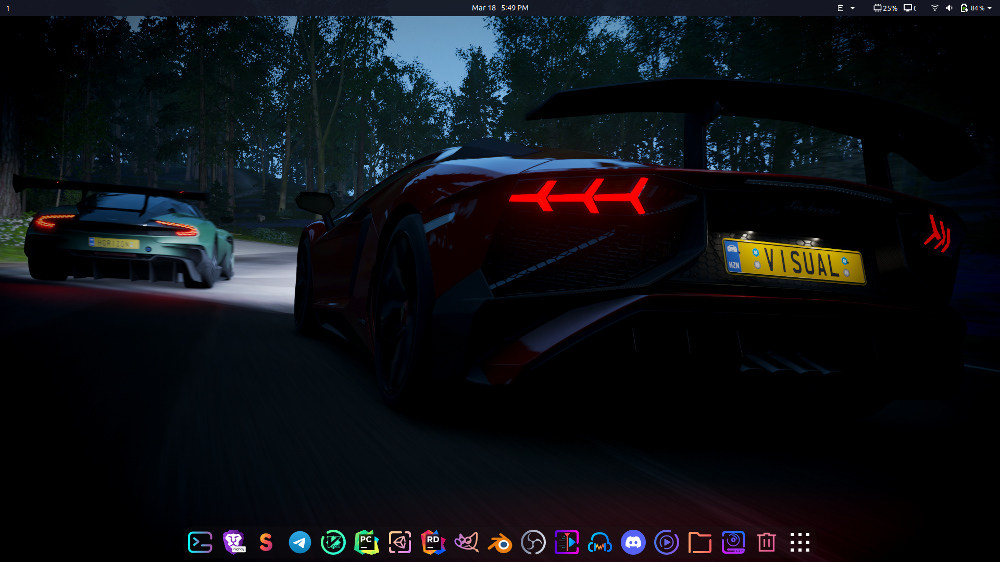

# After-install


<p align="center">
	<a href="https://github.com/vishal2376/after-install/issues">
	
	</a>
	<a href="https://github.com/vishal2376/after-install/stargazers">
	
	</a>
	<a href="https://github.com/vishal2376/after-install/blob/master/LICENSE">
	
	</a>
</p>


## Installation

```bash
  git clone https://github.com/vishal2376/after-install.git
  cd after-install
  chmod +x install.sh
  ./install.sh
```


## Screeshots :



## Themes & Icons Links


 - Theme [Sweet v40](https://www.gnome-look.org/p/1253385)
 - Icons [Candy icon](https://www.gnome-look.org/p/1305251)
 - Cursor [Oreo Cursor](https://www.gnome-look.org/p/1360254)

> Install after script complete

## Custom Shortcuts
[Command List](shortcuts)

## More projects :

 - [Virtual Assistant](https://github.com/vishal2376/virtual-assistant)
 - [C++ Mini Projects](https://github.com/vishal2376/cpp-mini-projects)
 - [Telegram Bot](https://github.com/vishal2376/telegram-bot)


## Contacts :

 - [Instagram](https://www.instagram.com/vishal_2376/)
 - [Telegram](https://t.me/vishal2376/)
 - [Join Telegram group](https://t.me/cppwithtricks)