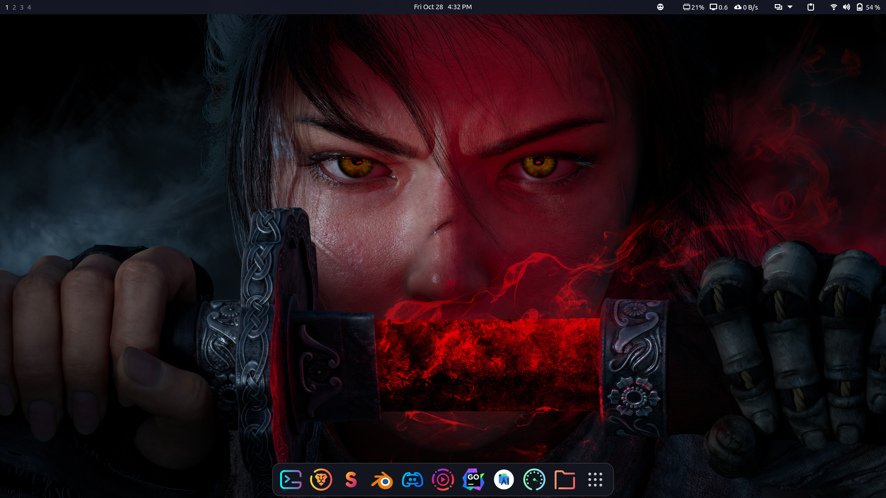
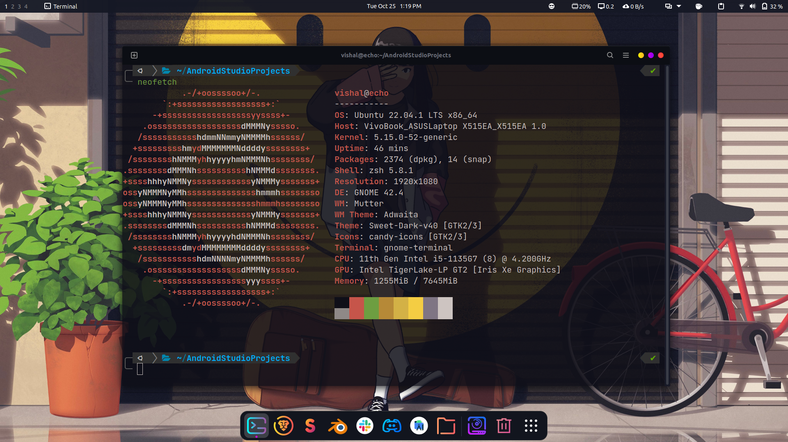
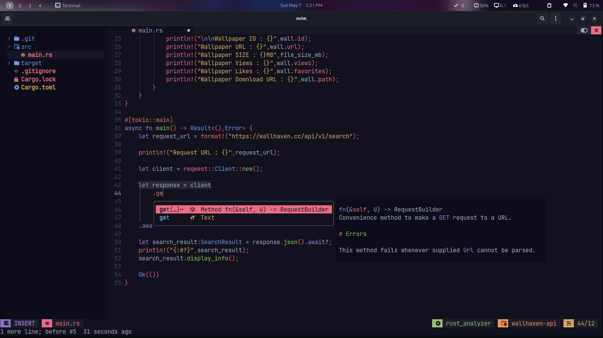

<div align="center">

# ✨**Ubuntu 2023 Dotfiles**✨

<br/>


</div>

<details>
<summary><h2>:package: Installation</h2></summary>

Clone Repository in Downloads folder
```bash
  git clone https://github.com/vishal2376/after-install.git ~/Downloads/after-install
```

Give Exceution Permissions
```bash
  cd ~/Downloads/after-install
  chmod +x install.sh post_install.sh
```
Install dependencies and copy config files
```bash  
  ./install.sh
```

 Restart OS after completing `install.sh`
 Install 
```bash
 cd ~/Downloads/after-install
 ./post_install.sh
```
</details>

<details>
<summary><h2>:sparkles: Theming</h2></summary>

 - Theme Installer [ocs-url](https://www.opendesktop.org/p/1136805/)
 > :warning: Download and install *ocs-url* before going to next step.
 <br>
 
 - GTK Theme [Lavanda - Dark](https://www.gnome-look.org/p/1944780)
 - Icons [Tela Circle - Dracula](https://www.gnome-look.org/p/1359276)
 - Cursor [Bibata - Dodger Blue](https://www.gnome-look.org/p/1269768)
 - Sounds [Mac OS](https://github.com/lucagoc/MacOSSounds4Gnome)
 - GRUB Theme [Dedsec - Legion](https://gitlab.com/VandalByte/dedsec-grub-theme)
<br>
 
 > :warning: GTK Themes work in Gnome 40, 41, 42 and 43 versions, but since Gnome 42 introduced Libadwaita the themes files for GTK4 applications must be placed in a new directory in a new path: '~/.config/gtk-4.0' with the name 'gtk.css'; this will apply the themes automatically without use Gnome Tweaks but, for GTK3 applications, we must always use Tweaks as we have done so far.
 
</details>


<details>
<summary><h2>:gear: Settings</h2></summary>

- [Terminal Settings](screenshots/terminal)

- [Custom Shortcuts](screenshots/shortcuts)

- [Gnome Extensions List](screenshots/extensions)

</details>

## Showcase :





## More projects :

 - [Virtual Assistant](https://github.com/vishal2376/virtual-assistant)
 - [Git Coach](https://github.com/vishal2376/git-coach)
 - [Telegram Bot](https://github.com/vishal2376/telegram-bot)

## Contacts :

 - [Instagram](https://www.instagram.com/vishal_2376/)
 - [Telegram](https://t.me/vishal2376/)
