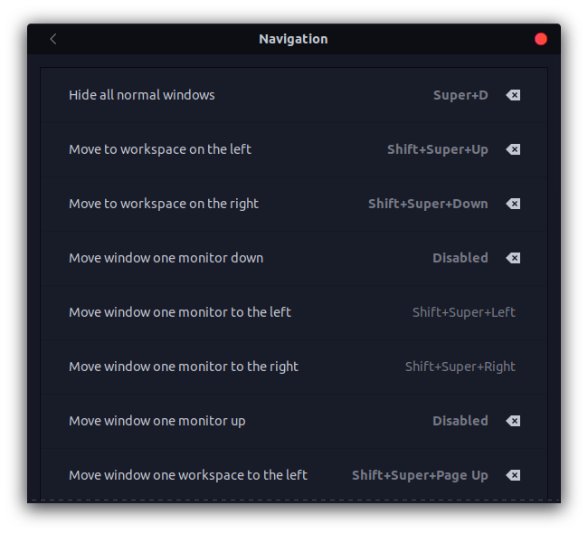

# Custom Shortcut List

> Run `post_install.sh` to set shortcut keys for below custom commands automatically.

- Disable Mouse Scroll
    ```gnome-terminal -- pkill imwheel```
- Enable Mouse Scroll
    ```mouse-scroll 3```
- Telegram
    ```telegram-desktop```
- Blender
    ```blender```
- Google
    ```google```
- Discord
    ```discord```
- Shutdown
    ```gnome-session-quit --power-off```
- Kill Application
    ```xkill```
- Sublime Text 4
    ```subl```
- Download Wallpaper
    ```waldl```
- Random Wallpaper
    ```change-wallpaper```
- Terminal
    ```gnome-terminal```


## Screenshots





